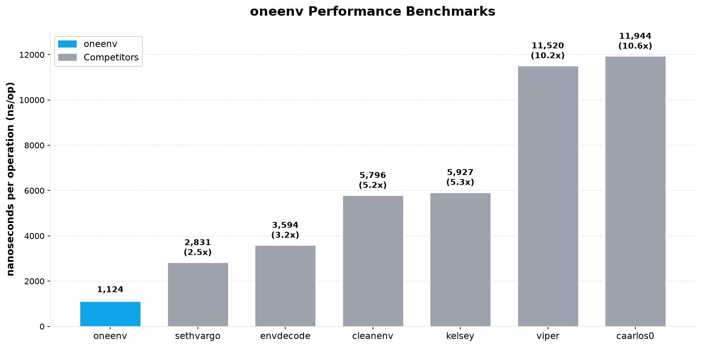

<div align="center">


# oneenv

**Parse `.env` files straight into your Go structs — zero dependencies, pure stdlib.**

[](https://pkg.go.dev/github.com/bakhod1r/oneenv)
[](https://goreportcard.com/report/github.com/bakhod1r/oneenv)
[](https://github.com/bakhod1r/oneenv/actions)
[](go.mod)
[](LICENSE)

**[📖 Full documentation](https://bakhod1r.github.io/oneenv/)**

</div>

---

## Table of contents

- [Why oneenv?](#why-oneenv)
- [Quick start](#quick-start)
- [Features](#features)
- [Install](#install)
- [Loading configuration](#loading-configuration)
- [Options](#options)
- [Struct tags](#struct-tags)
- [Supported types](#supported-types)
- [`.env` file syntax](#env-file-syntax)
- [Secrets from files](#secrets-from-files)
- [Masking secrets in output](#masking-secrets-in-output)
- [Environment-aware file cascade](#environment-aware-file-cascade)
- [Slices of structs](#slices-of-structs)
- [Hot reload](#hot-reload)
- [Custom type parsers](#custom-type-parsers)
- [Mutators](#mutators)
- [Validation](#validation)
- [Marshal — struct back to `.env`](#marshal--struct-back-to-env)
- [Usage — generate `--help`](#usage--generate---help)
- [Testing without global state](#testing-without-global-state)
- [Error handling](#error-handling)
- [Non-goals](#non-goals)
- [Benchmarks](#benchmarks)
- [License](#license)

---

## Why oneenv?

Loading configuration in Go usually takes two separate steps: reading the `.env`
file, and decoding environment variables into a struct. That often means two
dependencies, two APIs, and glue code between them.

`oneenv` does both in **one zero-dependency package** — parsing and decoding in a
single pass over a struct schema that is compiled once and cached — so it stays
[fast and lightweight](#benchmarks).

```go
type Config struct {
    Port    int           `env:"PORT" default:"8080"`
    Host    string        `env:"HOST,required"`
    Timeout time.Duration `env:"TIMEOUT" default:"5s"`
    Tags    []string      `env:"TAGS" separator:","`
    DB      DBConfig      `envPrefix:"DB_"`
}

cfg, err := oneenv.Parse[Config]()
if err != nil {
    log.Fatal(err)
}
fmt.Println(cfg.Port) // 8080
```

## Quick start

```go
package main

import (
    "fmt"
    "log"
    "time"

    "github.com/bakhod1r/oneenv"
)

type Config struct {
    Port    int           `env:"PORT" default:"8080"`
    Host    string        `env:"HOST,required"`
    Timeout time.Duration `env:"TIMEOUT" default:"5s"`
}

func main() {
    // Reads ".env" (if present) and merges it with the process environment.
    cfg, err := oneenv.Parse[Config]()
    if err != nil {
        log.Fatal(err)
    }
    fmt.Printf("%s:%d (timeout %s)\n", cfg.Host, cfg.Port, cfg.Timeout)
}
```

```dotenv
# .env
HOST=localhost
PORT=9090
TIMEOUT=30s
```

## Features

- 🪶 **Zero dependencies** — stdlib only. The whole library is a handful of small files.
- 🎯 **Straight to struct** — no `os.Getenv` boilerplate, no glue between two libraries.
- ⚡ **Fast** — byte-level, allocation-light parser; the struct schema is compiled once and cached, so repeated `Load`s are nearly free.
- 🧩 **Rich types** — ints, floats, bool, `time.Duration`, `time.Time`, slices, maps, pointers, nested structs, and any `encoding.TextUnmarshaler`.
- 🔐 **Secrets** — `env:"PASSWORD,file"` reads a value from a path (Docker/K8s `/run/secrets`); `,secret` + `Redacted` and `Secret[T]` keep sensitive values out of logs.
- 🌱 **Env-aware cascade** — `WithEnvFiles()` layers `.env`, `.env.local`, `.env.<env>`, `.env.<env>.local` like Rails/Next.js.
- 🧱 **Slices of structs** — repeated config from indexed keys (`SERVER_0_HOST`, `SERVER_1_HOST`, …).
- 🔄 **Hot reload** — `oneenv/watch` re-decodes on file change via native OS events (inotify / kqueue / Windows), still zero-dependency.
- 🧰 **Extensible** — custom per-type parsers (`WithTypeParser`), value mutators (`WithMutator`), and a pluggable `WithValidator` — all dependency-free.
- ↩️ **Round-trips** — `Marshal` renders a struct back to `.env`, and `Usage` prints a `--help` table of the variables a struct consumes.
- 🧪 **Hermetic tests** — a `Lookuper` interface means no global state and no `t.Setenv`; parallel-safe by design.
- 🧯 **Great errors** — positioned parse errors (`file:line`) and *all* field failures collected at once via `errors.Join`.
- 🔁 **Familiar API** — low-level `Read` / `LoadEnv` / `Overload` and a rich, conventional struct-tag vocabulary.

## Install

```bash
go get github.com/bakhod1r/oneenv
```

Requires **Go 1.26+**.

## Loading configuration

`oneenv` gives you a small, layered API. Pick the entry point that fits.

### `Parse` — allocate and decode

`Parse[T]` is the generic convenience form: it allocates a `T`, decodes into it,
and returns the pointer.

```go
cfg, err := oneenv.Parse[Config]()                       // reads the default ".env"

// Point it at one or more files — later files override earlier keys:
cfg, err := oneenv.Parse[Config](
    oneenv.WithFiles(".env", ".env.local", ".env.production"),
)
```

### `Load` — decode into an existing value

```go
var cfg Config
err := oneenv.Load(&cfg, oneenv.WithFiles(".env", ".env.local"))
```

`v` must be a non-nil pointer to a struct. Both `Parse` and `Load` are safe for
concurrent use.

### `Unmarshal` — decode raw bytes

Decodes `.env`-formatted bytes directly, without touching any file or the process
environment. Handy for embedded configs or tests.

```go
data := []byte("PORT=9090\nHOST=localhost")
var cfg Config
err := oneenv.Unmarshal(data, &cfg)
```

### `LoadContext` / `ParseContext` — thread a context

Use these when you register [mutators](#mutators) that need a `context.Context`.

```go
cfg, err := oneenv.ParseContext[Config](ctx, oneenv.WithMutator(resolveSecret))
```

### Low-level API

When you only need the raw values, not a struct:

```go
vals, _ := oneenv.Read(".env", ".env.local")   // merge files → map[string]string
_ = oneenv.LoadEnv(".env", ".env.local")        // sets os.Setenv (existing wins)
_ = oneenv.Overload(".env", ".env.local")       // sets os.Setenv (.env wins)
```

`Read`, `LoadEnv` and `Overload` are variadic — pass as many `.env` files as you
like; later files override earlier keys. With no arguments they default to `.env`.

## Options

`oneenv` uses the functional-options pattern — the zero config is already sensible,
options are applied in order, and a later option wins over an earlier one.

| Option | Description |
|---|---|
| `WithFiles(names...)` | `.env` files to read (default `.env`); later files override earlier keys. A missing default `.env` is not an error. |
| `WithEnvFiles()` | Enable the environment-aware cascade: also read `<base>.local`, `<base>.<env>`, `<base>.<env>.local` (all optional). |
| `WithEnvVar(names...)` | Which env variables name the active environment for `WithEnvFiles` (default `APP_ENV`, then `GO_ENV`). |
| `WithPrefix(p)` | Restrict lookups to keys carrying a prefix, e.g. `APP_` maps `env:"PORT"` to `APP_PORT`. |
| `WithOverride()` | Let `.env` values overwrite variables already in the process env (default: existing wins). |
| `WithExpand()` | Enable `${VAR}` / `$VAR` expansion inside values. |
| `WithRequired()` | Treat every field as required, as if each carried `,required`. |
| `WithTagKey(k)` | Change the struct tag key (default `env`). |
| `WithLookuper(l)` | Swap the env source — pass a `MapLookuper` for hermetic tests. |
| `WithTypeParser[T](fn)` | Register a custom parser for a specific type `T`. |
| `WithMutator(m)` | Transform each raw value before decoding (receives a `context.Context`). |
| `WithValidator(fn)` | Run a validation callback on the decoded struct — plug in any validator, zero-dep. |
| `WithContext(ctx)` | Context passed to mutators (also via `LoadContext` / `ParseContext`). |

## Struct tags

```go
type Config struct {
    Port     int           `env:"PORT" default:"8080" desc:"listen port"`
    Host     string        `env:"HOST,required"`
    Tags     []string      `env:"TAGS" separator:","`
    Labels   map[string]int `env:"LABELS"`               // KEY:VALUE pairs, comma-separated
    Started  time.Time     `env:"STARTED" layout:"2006-01-02"`
    Password string        `env:"PASSWORD,file"`          // value read from the file at this path
    Token    string        `env:"TOKEN,notEmpty"`         // present but empty is an error
    Ignored  string        `env:"-"`                      // never populated
    DB       DBConfig      `envPrefix:"DB_"`              // nested struct
}
```

### Tag reference

| Tag | Applies to | Meaning |
|---|---|---|
| `env:"NAME"` | any field | Environment key. Defaults to the Go field name if omitted. `env:"-"` skips the field. |
| `env:"NAME,required"` | any field | Fail if the value is absent from every source. |
| `env:"NAME,notEmpty"` | any field | Fail if the value is present but empty. |
| `env:"NAME,file"` | string-ish | Treat the resolved value as a **path** and read the file's contents as the real value. |
| `env:"NAME,init"` | pointer / slice / map | Allocate a non-nil zero value even when no value is supplied. |
| `env:"NAME,unset"` | any field | Remove the variable from the process environment after reading it. |
| `env:"NAME,secret"` | any field | Mask the value in `Redacted` / `RedactedMap` output (plain `Marshal` keeps it). |
| `default:"..."` | any field | Fallback value when nothing else provides one. |
| `separator:","` | slice / map | Element separator. `envSeparator` is accepted as an alias. |
| `layout:"..."` | `time.Time` | `time.Parse` layout (default `time.RFC3339`). |
| `envPrefix:"DB_"` | nested struct | Prefix applied to every key inside the nested struct. |
| `desc:"..."` | any field | Human description, surfaced by [`Usage`](#usage--generate---help). |

Multiple options combine: `env:"TOKEN,required,file"` reads a required secret file.

### `env-*` tag aliases

Every configuration tag also has an `env-*` spelling, so an `env`-prefixed
convention can be used throughout:

| Native | `env-*` alias |
|---|---|
| `default:"8080"` | `env-default:"8080"` |
| `separator:","` (or `envSeparator`) | `env-separator:","` |
| `desc:"..."` | `env-description:"..."` |
| `layout:"..."` | `env-layout:"..."` |
| `envPrefix:"DB_"` | `env-prefix:"DB_"` |
| `env:"NAME,required"` | `env-required:"true"` |
| `env:"NAME,notEmpty"` | `env-notempty:"true"` |
| `env:"NAME,file"` | `env-file:"true"` |
| `env:"NAME,init"` | `env-init:"true"` |
| `env:"NAME,unset"` | `env-unset:"true"` |

```go
type Config struct {
    Port int      `env:"PORT" env-default:"8080" env-description:"listen port"`
    Tags []string `env:"TAGS" env-separator:";"`
    Host string   `env:"HOST" env-required:"true"`
    DB   DBConfig `env-prefix:"DB_"`
}
```

**Priority when both spellings are present:** the `env-*` form always wins; the
native tag is the fallback. A boolean `env-*` tag like `env-required:"false"`
explicitly turns the option off.

### Resolution priority

For each field the value is resolved in this order:

1. **Explicit environment variable** (via the `Lookuper`, default `os.LookupEnv`)
2. **`.env` file** value
3. **`default` tag**

With `WithOverride()`, `.env` file values take precedence over the process
environment. A field with no value from any source and no `default` is left at its
zero value — unless it is `required`.

## Supported types

| Category | Types |
|---|---|
| Strings | `string` |
| Booleans | `bool` (`strconv.ParseBool`: `1`, `t`, `true`, `TRUE`, …) |
| Integers | `int`, `int8`…`int64`, `uint`, `uint8`…`uint64` |
| Floats | `float32`, `float64` |
| Time | `time.Duration` (`"5s"`, `"1h30m"`), `time.Time` (RFC3339 or `layout` tag) |
| Collections | `[]T` (any supported `T`), `map[string]T` (`key:value` pairs) |
| Pointers | `*T` for any supported `T` (allocated only when a value is present) |
| Nested | structs (recursed into, with optional `envPrefix`) |
| Custom | any `encoding.TextUnmarshaler`, or any type via [`WithTypeParser`](#custom-type-parsers) |

Slices and maps use the field's separator (default `,`); map entries are
`key:value`. For example `LABELS=a:1,b:2` decodes into `map[string]int{"a":1,"b":2}`.

## `.env` file syntax

`oneenv` supports the syntax you expect from a mature `.env` parser:

```dotenv
# A comment line.
export PATH_STYLE=ok            # "export " prefix is allowed; inline comments too

PLAIN=value
QUOTED="double quoted"          # escapes: \n \r \t \" \\
RAW='single quoted'             # no escapes, no expansion — taken literally
MULTILINE="line one
line two"                       # newlines allowed inside double quotes

GREETING="Hello ${USER}"        # ${VAR} / $VAR expansion — only with WithExpand()
LITERAL='$NOT_EXPANDED'         # single quotes never expand
```

- **Comments** — a `#` starting a line, or preceded by whitespace on a value line.
- **`export ` prefix** — accepted and ignored, so you can `source` the same file.
- **Quotes** — double quotes honour escapes and can span multiple lines; single quotes are literal.
- **Expansion** — `${VAR}` and `$VAR` are expanded (when `WithExpand()` is set) against values already parsed in the file, falling back to the process environment. Write `$$` for a literal `$`.

Syntax errors come back as a [`*ParseError`](#error-handling) carrying the file
name and line number.

## Secrets from files

Containers and orchestrators mount secrets as files (`/run/secrets/...`,
Kubernetes secret volumes). Add `,file` and `oneenv` reads the file's contents as
the value — the environment variable holds the **path**, not the secret itself.

```go
type Config struct {
    DBPassword string `env:"DB_PASSWORD,file"`
}
```

```dotenv
DB_PASSWORD=/run/secrets/db_password
```

A trailing newline in the file is trimmed. If the file can't be read, the field
error wraps `ErrSecretFile`. Combine with `default` to provide a fallback path, or
with `required` to insist the secret exists.

## Masking secrets in output

Two ways to keep sensitive values out of logs, dumps and `--help` output.

**`,secret` tag + `Redacted`.** Mark a field secret and render the struct with
`Redacted` (or `RedactedMap`); the mask replaces only the marked values, while
plain `Marshal` still emits the real value.

```go
type Config struct {
    Host     string `env:"HOST"`
    Password string `env:"PASSWORD,secret"`
}

out, _ := oneenv.Redacted(cfg)
// HOST=db
// PASSWORD=****
```

**`Secret[T]` wrapper.** Wrap any decodable type; its `String`, `%v`/`%#v` and
JSON forms are always masked, so it can't leak through logging by accident. The
real value is available via `.Value()`.

```go
type Config struct {
    APIKey oneenv.Secret[string] `env:"API_KEY"`
}

fmt.Println(cfg.APIKey)         // ****
client.Auth(cfg.APIKey.Value()) // the real key
```

## Environment-aware file cascade

`WithEnvFiles()` layers files by the active environment, the convention used by
Rails, Next.js and dotenv-cli. On top of each base file it also reads
`<base>.local`, `<base>.<env>` and `<base>.<env>.local`, each optional, later
files overriding earlier keys:

```go
cfg, err := oneenv.Parse[Config](oneenv.WithEnvFiles())
// with APP_ENV=production, reads in increasing priority:
//   .env  →  .env.local  →  .env.production  →  .env.production.local
```

The environment name comes from `APP_ENV`, then `GO_ENV`; change the sources
with `WithEnvVar("MY_ENV")`. `FilesFor(opts...)` returns the resolved list.

## Slices of structs

A `[]Struct` field is decoded from indexed keys: the field's env name, then
`_<index>_`, then the element's key. Decoding starts at index `0` and stops at
the first index with no keys present.

```go
type Server struct {
    Host string `env:"HOST"`
    Port int    `env:"PORT"`
}
type Config struct {
    Servers []Server `env:"SERVER"`
}
```

```dotenv
SERVER_0_HOST=a
SERVER_0_PORT=1
SERVER_1_HOST=b
SERVER_1_PORT=2
```

## Hot reload

The `oneenv/watch` subpackage re-decodes your struct whenever a watched `.env`
file changes. It uses native OS notifications — **inotify** on Linux, **kqueue**
on BSD/macOS and **ReadDirectoryChangesW** on Windows — with modification-time
**polling** as a fallback on any other platform. All standard library, so the
zero-dependency guarantee still holds.

```go
import "github.com/bakhod1r/oneenv/watch"

var cfg Config
ctx, cancel := context.WithCancel(context.Background())
defer cancel()

// Blocks until ctx is cancelled. Read cfg inside onReload (or guard it with a
// mutex): Watch writes cfg concurrently with your readers.
watch.Watch(ctx, &cfg, func(err error) {
    if err != nil {
        log.Printf("reload failed: %v", err)
        return
    }
    log.Printf("config reloaded")
}, oneenv.WithEnvFiles())
```

## Custom type parsers

Register a parser for any specific type without implementing `TextUnmarshaler`.
It also applies to that type inside slices, maps and pointers.

```go
import "net"

cfg, err := oneenv.Parse[Config](
    oneenv.WithTypeParser(func(s string) (net.IP, error) {
        return net.ParseIP(s), nil
    }),
)
```

> **Note:** registering any type parser bypasses the shared schema cache for that
> call, since the same type could decode differently between calls. Register your
> parsers once and reuse the option set to keep things fast.

## Mutators

A `Mutator` transforms every raw value after lookup and before decoding. Mutators
run in registration order, each receiving the previous one's output and a
`context.Context`. Perfect for resolving indirections (secret managers, templating)
or normalising values.

```go
cfg, err := oneenv.ParseContext[Config](ctx,
    oneenv.WithMutator(func(ctx context.Context, key, val string) (string, error) {
        if ref, ok := strings.CutPrefix(val, "sm://"); ok {
            return secretmanager.Resolve(ctx, ref)   // your code
        }
        return val, nil
    }),
)
```

Returning an error from a mutator fails that field and is reported like any other
field error.

## Validation

`oneenv` stays dependency-free, so it ships no validator — but `WithValidator`
lets you attach any one you like. It runs once, on the fully decoded struct, after
a successful decode.

```go
import "github.com/go-playground/validator/v10"

v := validator.New()
cfg, err := oneenv.Parse[Config](
    oneenv.WithValidator(func(c any) error { return v.Struct(c) }),
)
```

## Marshal — struct back to `.env`

`Marshal` renders a struct into `.env` bytes (sorted `KEY=value` lines, values
quoted and escaped when needed). `MarshalMap` returns the flat `map[string]string`
instead. Prefixes from nested structs are applied, so the output round-trips
through `Unmarshal`.

```go
data, _ := oneenv.Marshal(cfg)
os.Stdout.Write(data)
// DB_HOST=localhost
// DB_PORT=5432
// NAME="app one"
// TAGS=a,b

m, _ := oneenv.MarshalMap(cfg)   // map[string]string
```

## Usage — generate `--help`

`Usage[T]` writes a table of the variables a struct consumes — key, type, whether
it's required, its default, and the `desc` tag — ideal for a `--help` flag.

```go
oneenv.Usage[Config](os.Stdout)
```

```text
KEY   TYPE           REQUIRED  DEFAULT  DESCRIPTION
PORT  int            no        8080     listen port
HOST  string         yes                bind host
```

## Example — generate `.env.example`

`Example[T]` writes a ready-to-fill `.env.example` for the variables a struct
consumes: each key with its default (empty when none), preceded by the `desc`
tag, the type, and whether it's required. Secret defaults are never written.

```go
oneenv.Example[Config](os.Stdout)
```

```text
# listen port
# type: int
PORT=8080

# bind host
# type: string, required
HOST=
```

The CLI can also produce one from your existing `.env` files — keys are kept,
values stripped:

```sh
oneenv -example            # writes .env.example next to you
oneenv -f .env -example -o -   # print to stdout
```

## Testing without global state

The decoder never touches `os.Getenv` directly — everything flows through a
`Lookuper`. In tests, pass a `MapLookuper` and skip `os.Setenv` / `t.Setenv`
entirely, so tests stay hermetic and `t.Parallel()`-safe.

```go
func TestConfig(t *testing.T) {
    t.Parallel()

    lookuper := oneenv.MapLookuper{"PORT": "3000", "HOST": "test"}

    var cfg Config
    if err := oneenv.Load(&cfg, oneenv.WithLookuper(lookuper)); err != nil {
        t.Fatal(err)
    }
    // assert on cfg…
}
```

## Error handling

A single `Load` reports **every** missing or malformed variable at once (joined
via `errors.Join`), not one at a time — so you fix your config in one pass.

```go
if err := oneenv.Load(&cfg); err != nil {
    var pe *oneenv.ParseError
    if errors.As(err, &pe) {
        fmt.Printf("syntax error at %s:%d — %s\n", pe.File, pe.Line, pe.Msg)
    }

    var fe *oneenv.FieldError
    if errors.As(err, &fe) {
        fmt.Printf("field %s (env %q) failed: %v\n", fe.Field, fe.Key, fe.Err)
    }
}
```

### Sentinel errors

Match the cause with `errors.Is`:

| Sentinel | Returned when |
|---|---|
| `ErrNotAStruct` | The target isn't a non-nil pointer to a struct. |
| `ErrRequired` | A `required` field has no value from any source. |
| `ErrEmpty` | A `notEmpty` field is present but empty. |
| `ErrSecretFile` | A `file` field names a path that can't be read. |
| `ErrUnsupportedType` | A field has a type `oneenv` can't decode. |

### Error types

- **`*ParseError`** — a syntax error in a source, with `File`, `Line` and `Msg`.
- **`*FieldError`** — a decode failure, with the struct `Field` path (e.g. `DB.Port`), the env `Key`, and the underlying `Err` (`Unwrap`-able).

## Non-goals

To stay fast and dependency-free, `oneenv` deliberately does **not** ship:

- **File watching / live reload** — no background file-watching machinery. Re-`Load` when you need fresh values.
- **Multiple config formats** (yaml/json/toml) — `oneenv` is `.env`-only by design.
- **A bundled validation library** — use [`WithValidator`](#validation) to attach your own.

## Benchmarks

The **full pipeline** — turn a `.env` file into a populated config struct —
against six popular libraries, measured at three config sizes: **small** (5
keys), **medium** (30 keys) and **large** (120 keys). Every row does the same
end-to-end work on the same config; env-only decoders are paired with `godotenv`
to read the file (the usual real-world combo). Correctness is asserted before
timing.

```
goversion: 1.26.2   goos: darwin   goarch: arm64   cpu: Apple M4 Pro   -count=5 (medians)
```



**Small — 5 keys**

| Library | ns/op | B/op | allocs/op | vs oneenv |
|---|---:|---:|---:|---:|
| **oneenv** | **621** | **752** | **17** | **1.0×** |
| `sethvargo/go-envconfig` | 1,803 | 839 | 32 | 2.9× |
| `joeshaw/envdecode` | 2,383 | 980 | 42 | 3.8× |
| `ilyakaznacheev/cleanenv` | 3,623 | 3,244 | 71 | 5.8× |
| `kelseyhightower/envconfig` | 3,647 | 2,552 | 88 | 5.9× |
| `spf13/viper` | 7,357 | 12,120 | 124 | 11.8× |
| `caarlos0/env` v11 | 7,660 | 15,378 | 141 | 12.3× |

**Medium — 30 keys**

| Library | ns/op | B/op | allocs/op | vs oneenv |
|---|---:|---:|---:|---:|
| **oneenv** | **4,091** | **5,528** | **74** | **1.0×** |
| `sethvargo/go-envconfig` | 11,591 | 7,115 | 164 | 2.8× |
| `joeshaw/envdecode` | 15,374 | 7,919 | 224 | 3.8× |
| `caarlos0/env` v11 | 20,565 | 26,561 | 330 | 5.0× |
| `kelseyhightower/envconfig` | 22,000 | 19,300 | 495 | 5.4× |
| `ilyakaznacheev/cleanenv` | 22,017 | 18,329 | 380 | 5.4× |
| `spf13/viper` | 45,583 | 52,423 | 568 | 11.1× |

**Large — 120 keys**

| Library | ns/op | B/op | allocs/op | vs oneenv |
|---|---:|---:|---:|---:|
| **oneenv** | **16,533** | **22,488** | **258** | **1.0×** |
| `sethvargo/go-envconfig` | 46,582 | 29,698 | 618 | 2.8× |
| `joeshaw/envdecode` | 60,306 | 32,951 | 858 | 3.6× |
| `caarlos0/env` v11 | 65,754 | 66,251 | 968 | 4.0× |
| `ilyakaznacheev/cleanenv` | 85,087 | 75,138 | 1,466 | 5.1× |
| `kelseyhightower/envconfig` | 91,126 | 59,966 | 1,939 | 5.5× |
| `spf13/viper` | 231,347 | 199,626 | 2,035 | 14.0× |

`oneenv` is the fastest and lightest of the group at every size — **2.8–14.0×
faster** with the fewest allocations (up to **20× less** memory than `caarlos0`
at small, ~9× less than `viper` at large) — because it parses and decodes in a
single pass over a struct schema that is compiled once and cached. Reproduce:

```bash
cd internal/bench && go test -bench . -benchmem -count=5
```

The comparison lives in its own module, so the root package stays
dependency-free.

## License

[MIT](LICENSE) © [bakhod1r](https://github.com/bakhod1r)
