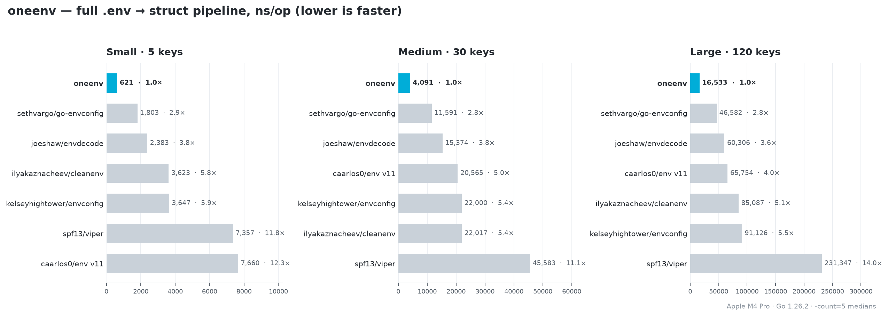

# Benchmarks

The **full pipeline** — turn a `.env` file into a populated config struct —
against six popular libraries, measured at three config sizes: **small** (5
keys), **medium** (30 keys) and **large** (120 keys). Every row does the same
end-to-end work on the same config; env-only decoders are paired with `godotenv`
to read the file (the usual real-world combo). Correctness is asserted before
timing.

```
goversion: 1.26.2   goos: darwin   goarch: arm64   cpu: Apple M4 Pro   -count=5 (medians)
```



## Small — 5 keys

| Library | ns/op | B/op | allocs/op | vs oneenv |
|---|---:|---:|---:|---:|
| **oneenv** | **621** | **752** | **17** | **1.0×** |
| `sethvargo/go-envconfig` | 1,803 | 839 | 32 | 2.9× |
| `joeshaw/envdecode` | 2,383 | 980 | 42 | 3.8× |
| `ilyakaznacheev/cleanenv` | 3,623 | 3,244 | 71 | 5.8× |
| `kelseyhightower/envconfig` | 3,647 | 2,552 | 88 | 5.9× |
| `spf13/viper` | 7,357 | 12,120 | 124 | 11.8× |
| `caarlos0/env` v11 | 7,660 | 15,378 | 141 | 12.3× |

## Medium — 30 keys

| Library | ns/op | B/op | allocs/op | vs oneenv |
|---|---:|---:|---:|---:|
| **oneenv** | **4,091** | **5,528** | **74** | **1.0×** |
| `sethvargo/go-envconfig` | 11,591 | 7,115 | 164 | 2.8× |
| `joeshaw/envdecode` | 15,374 | 7,919 | 224 | 3.8× |
| `caarlos0/env` v11 | 20,565 | 26,561 | 330 | 5.0× |
| `kelseyhightower/envconfig` | 22,000 | 19,300 | 495 | 5.4× |
| `ilyakaznacheev/cleanenv` | 22,017 | 18,329 | 380 | 5.4× |
| `spf13/viper` | 45,583 | 52,423 | 568 | 11.1× |

## Large — 120 keys

| Library | ns/op | B/op | allocs/op | vs oneenv |
|---|---:|---:|---:|---:|
| **oneenv** | **16,533** | **22,488** | **258** | **1.0×** |
| `sethvargo/go-envconfig` | 46,582 | 29,698 | 618 | 2.8× |
| `joeshaw/envdecode` | 60,306 | 32,951 | 858 | 3.6× |
| `caarlos0/env` v11 | 65,754 | 66,251 | 968 | 4.0× |
| `ilyakaznacheev/cleanenv` | 85,087 | 75,138 | 1,466 | 5.1× |
| `kelseyhightower/envconfig` | 91,126 | 59,966 | 1,939 | 5.5× |
| `spf13/viper` | 231,347 | 199,626 | 2,035 | 14.0× |

`oneenv` is the fastest and lightest of the group at every size — **2.8–14.0×
faster** with the fewest allocations (up to **20× less** memory than `caarlos0`
at small, ~9× less than `viper` at large) — because it parses and decodes in a
single pass over a struct schema that is compiled once and cached. Reproduce:

```bash
cd internal/bench && go test -bench . -benchmem -count=5
```

The comparison lives in its own module, so the root package stays
dependency-free.
